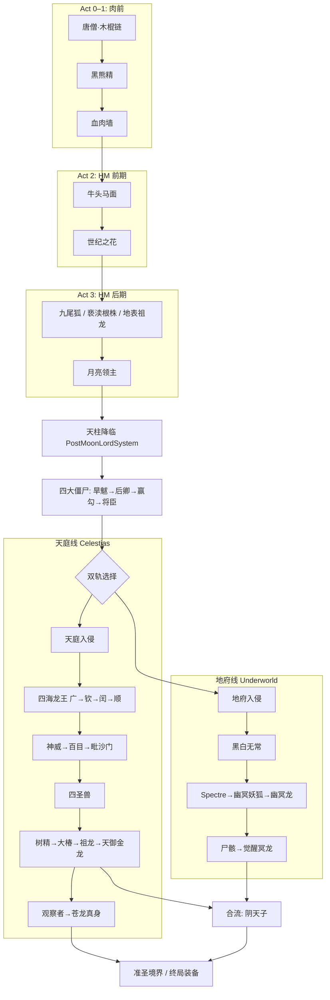
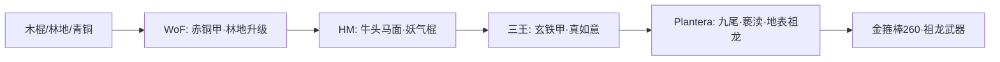

# 洪荒模组（Primordial）进度设计规范书

> **文档性质：** 可玩性设计的**唯一权威规格**（Master Design Spec）  
> **版本：** 3.3.1 · 2026-05-28  
> **来源：** `PLAYABILITY_AUDIT_REPORT.md` + 四路并行设计会话（前期中期 / 天庭 / 地府 / 元系统）  
> **代码规模参考：** ~558 `.cs` · ~205 物品 · ~66 NPC · ~130 武器 · 40+ Boss

---

## 1. 文档说明与设计原则 Document Purpose & Principles

### 1.1 本文档与审计报告的关系

| 文档 | 用途 |
|------|------|
| `docs/PLAYABILITY_AUDIT_REPORT.md` | **现状审计**：已实现内容、缺口清单、P0–P3 优先级 |
| `docs/PROGRESSION_DESIGN_SPEC.md`（本文） | **目标设计**：掉落/配方/门控/数值/文件路径，供实现对照 |

本文**不重复**审计全文，仅引用结论并给出可落地的设计决策。

### 1.2 核心设计原则

1. **单线脊柱 + 月后双轨：** 肉前→月前为共享脊柱；月后 **天庭（Celestias）** 与 **地府（Underworld）** 并行，终局在阴天子/苍龙真身处合流。
2. **每个 Boss 必须回答三件事：** 掉什么？解锁什么？下一个打谁？
3. **`DownedBoss` 标记是唯一进度 API：** 配方、召唤、NPC、修仙门控、万魂幡均读取同一注册表（修复 WorldLoad 重置后为前提）。
4. **数值分阶段：** 前期～中期（Plantera 邻接）与月后终局分开标定；亵渎线、酆都武器采用**两阶段**（中期面板 / ML 升华）。
5. **神话为约束而非装饰：** 每条掉落/门控需 1–2 句神话依据；玩法机制与主题一致（天庭=序/暴击，地府=终/DoT）。

### 1.3 已解决的跨线冲突（权威裁定）

| 冲突点 | 天庭线提议 | 地府线提议 | 元系统提议 | **本文裁定** |
|--------|-----------|-----------|-----------|-------------|
| 万魂幡 T29–37 vs T29–35 | T29 敖广…T35 苍龙 | T29 地府入侵…T37 阴天子 | T1–48 全表 + 重排 T24–32 | **v3.3.1：T1–52**；T24–27 四僵尸；T28+ 天庭/地府顺延；地府从 **T46** 起 |
| 万魂幡 T24–28 顺序 | 保持神威→百目→毗沙门→敖顺 | — | 九尾→神威→百目→四海→毗沙门 | **T24–27 四僵尸 → T28 九尾 → T29–30 天将 → T31–34 四海 → T35 毗沙门** |
| 四僵尸进度位 | 肉前赢勾 / HM 四灾 | — | — | **§1.4：月后 T24–27，红木棺材 + 鬼面具(ML)** |
| 亵渎 Profane 伤害 | ML 1400–1500（现状） | — | — | **Plantera 后 320–380**；ML 后 `ProfaneCore`（树精）升华 +200 |
| 地表祖龙 vs Celestias 祖龙 | — | — | 可选 ambient | **双实体**：地表 90k（中期）；Celestias 800万（月后），独立掉落表 |
| 酆都 Fengdu 面板 | — | 调谐有效 DPS 5500–6500 | — | **目标有效 DPS** 与天庭祖龙持平；面板可保留 12000+，用攻速/MP 折算 |
| 青龙之灵 QingLongSpirit | 四圣兽 100% | 地表祖龙 bootstrap | — | **地表祖龙 2–4 + 劫云合成**；**Qinlong ML 6–10**；不互相替代 |
| 奇异石/生肖精魄 | 1/800 + pity | 入侵保底 + 定向 Boss | 1/8000→定向表 | **1/800 全局 + Boss 必掉 1 + pity 计数器 + 定向表（元系统 §5.2）** |

### 1.4 设计勘误 — 四大僵尸进度位（v3.3.1）

**勘误原因：** 早期设计会话误将 **四大僵尸**（旱魃、后卿、赢勾、将臣）写入肉前～Plantera 脊柱；与代码中 **红木棺材月后生成**（`RedwoodCoffinGenSystem` 需 `NPC.downedMoonlord`）及 Boss 体量（40 万级 HP）不一致。

**权威裁定（本文 v3.3.1 起）：**

| 项目 | 旧设计（错误） | 新设计（权威） |
|------|----------------|----------------|
| 出现时机 | 赢勾 T7 肉前；旱魃 T15 / 后卿 T17 / 将臣 T21 HM | **月灵之后**，与天柱降临同门槛 |
| 召唤 | 赢勾肉前可召；四灾混在 HM 棺材 | **红木棺材**地下随机生成（已实现）；**鬼面具**仅召赢勾且需 ML |
| 推荐顺序 | 无统一序 | **旱魃 → 后卿 → 赢勾 → 将臣**（神话灾序 + 武器梯度） |
| 万魂幡 | T7 / T15 / T17 / T21 | **T24–T27**（T23 月灵之后、T28 九尾狐之前） |
| 修仙 G3 | 任一四灾 | **移除**；G3 改为 `downedPlantBoss`；四灾移至 **G5**（ML + 任一四灾 + 大椿） |
| 妖气经济 | 赢勾/四灾作 HM 脊柱 | 地表怪 1/10 **保留**；四灾妖气为 **月后补充**，非前期主轴 |

**代码现状备忘（实现差距，非设计）：** `SoulBannerPlayer.cs` 仍将赢勾置于 T7、四僵尸混在 HM（T15/T17/T21）；`YingouSummon.cs`（鬼面具）**未**检查 `downedMoonlord` — Phase 2 须对齐。

### 1.5 二次迭代勘误（ITERATION V2）

> **完整核查与裁定：** `docs/PROGRESSION_DESIGN_ITERATION_V2.md`（2026-05-28）

| 主题 | 本文 v3.3.1 | 迭代 V2 补充 |
|------|-------------|--------------|
| 九尾妖狐 | Act 4a 表 T28（月后四僵尸之后） | **裁定：Plantera 后 HM**，位于 ML **之前**；万魂幡目标 tier 与 Act 3 对齐（非 T28） |
| 四僵尸 | 月后 T24–27（§1.4 权威） | 不变 |
| 未实现设计路径 | 正文多处「待建/新建」 | 统一标 **Phase 2**（见 ITERATION_V2 §2 / §5） |
| 红木棺材 | 每世界 5 处 | 代码仅常 1 处 + `OnWorldLoad` 重置（§4） |
| 黑熊武器率 | 附录 A 写 20% | **代码 10%**（`Common(..., 10)`） |

---

## 2. 总进度路线图 Master Progression Roadmap

### 2.1 全局流程图



### 2.2 权威 Boss 顺序表（48 节点）

图例：`[V]` 原版 · `[M]` 模组 Boss · `[E]` 事件 · `[T]` 劫云（无战利品）

#### Act 0 — 地表前期
| # | 节点 | 类型 | 血量/规模 | 解锁要点 | 万魂幡 |
|---|------|------|----------|----------|--------|
| — | 唐僧 NPC | — | — | 木棍链引导 | — |
| — | 地表小怪 | — | — | 妖气 1/10 | — |

#### Act 1 — 肉前
| # | Boss | 类型 | 对齐原版 | SB Tier | 关键掉落/门控 |
|---|------|------|----------|---------|---------------|
| 1 | 史莱姆王 | [V] | — | T1 (50) | — |
| 2 | 克苏鲁之眼 | [V] | — | T2 (120) | — |
| 3 | **黑熊精** | [M] | EoC 后 | T3 (200) | 3 武器 + 天界之钥；`downedBlackBear` → 杨戬 |
| 4 | 世吞/克脑 | [V] | — | T4 (300) | — |
| 5 | 蜂后 | [V] | — | T5 (420) | — |
| 6 | 骷髅王 | [V] | — | T6 (560) | — |
| 7 | 鹿角怪 | [V] | — | T7 (880) | — |
| 8 | 血肉墙 | [V] | — | T8 (1100) | HM 开始 |

#### Act 2 — 困难模式（Plantera 前）
| # | Boss | 类型 | SB Tier | 关键设计 |
|---|------|------|---------|----------|
| 9 | **牛头马面** | [M] | T9 (1350) | 冥途双引符召唤；双印 + 链刃/勾魂索；`downedNiuMa` |
| 10 | 史莱姆皇后 | [V] | T10 | — |
| 11–13 | 三王 | [V] | T11–13 | 玄铁甲门控 |
| 14 | 世纪之花 | [V] | T14 | 地府怪加强 |

#### Act 3 — 困难模式（Plantera 后 → ML）
| # | Boss | 类型 | SB Tier | 关键设计 |
|---|------|------|---------|----------|
| 15–17 | 石巨人/光女/猪鲨 | [V] | T18–20 | — |
| 18–19 | 教徒/月亮领主 | [V] | T22–23 | `PostMoonLordSystem` 天柱 |

#### Act 3.5 — 月后早期 · 四大僵尸（§1.4）
| # | Boss | 类型 | SB Tier | 血量 | 召唤 | 关键设计 |
|---|------|------|---------|------|------|----------|
| 20 | **旱魃** | [M] | T24 (7400) | 400k | 红木棺材（ML 后地下生成） | 旱日 145 魔；妖气 10–20；牛精魄 1/4 |
| 21 | **后卿** | [M] | T25 (8150) | 400k | 红木棺材 | 劫骇 136 召；羊精魄 1/4 |
| 22 | **赢勾** | [M] | T26 (8900) | 420k | 红木棺材 / **鬼面具**（须 ML） | 鬼牙 342；尸钉残片 1/3 |
| 23 | **将臣** | [M] | T27 (9650) | 420k | 红木棺材 | 雷鸣锤 680；妖气 10–20 |

**推荐挑战顺序：** 旱魃 → 后卿 → 赢勾 → 将臣（旱神灾 → 瘟疫始祖 → 鬼将 → 飞僵）。棺材 `RedwoodCoffinTP` 随机四选一；鬼面具定向赢勾。

**红木棺材生成（已实现，有 bug）：** `RedwoodCoffins/RedwoodCoffinGenSystem.cs` — `NPC.downedMoonlord` 后每 10s 检测；**设计**每世界最多 5 处。**代码问题：** `OnWorldLoad()` 将 `coffinsGenerated` 归零（与 `LoadWorldData` 冲突）；且 `TileProcessorLoader` 检测到**任意**棺材存在即停止生成（常仅 1 处）。打开棺材随机召唤四僵尸之一。详见 `PROGRESSION_DESIGN_ITERATION_V2` §1 / §4。

#### Act 4a — 天庭线（月后）
| # | Boss/事件 | SB Tier | 血量 | 门控 |
|---|----------|---------|------|------|
| — | `[E]` 天庭入侵 | —* | 事件 | `downedHeavenInvasion`；天界碎片 |
| — | **九尾妖狐** | **T15 目标**（代码 SB T24） | 75k | 狐毫召唤；狐火宝珠；**Plantera 后 HM**（**非**月后四僵尸之后，见 §1.5） |
| 25 | **神威** | T29 (11200) | 200万 | 断罪刃等；须先入侵 |
| 26 | **百目** | T30 (12050) | 200万 | 追魂弧等；须 downedVigor |
| 27 | **敖广** | T31 (12900) | 450k | 龙王鳞 8–12；5 武器各 5% |
| 28 | **敖钦** | T32 (13750) | 420k | 火龙主题 5 武器 |
| 29 | **敖闰** | T33 (14600) | 430k | 冰龙主题 |
| 30 | **敖顺** | T34 (15450) | 430k | 雷暴主题 |
| 31 | **毗沙门天** | T35 (16300) | 135万 | 宝塔杖三选一 |
| 32 | **树精** | T36 (17150) | 100万 | 活木 |
| 33 | **大椿** | T37 (18000) | 450万 | 傲世神木；**修仙 G5** |
| 34 | **青龙** | T38 (18950) | 200万 | 青龙之灵 6–10；15% 苍龙觉醒 |
| 35 | **白虎** | T39 (19900) | 200万 | 白虎之灵 |
| 36 | **朱雀** | T40 (20850) | 200万 | 朱雀之灵 |
| 37 | **玄武** | T41 (21800) | 250万 | 玄武之灵；四象集齐 SB +15% 伤 |
| 38 | **祖龙残魂** | T42 (22750) | 800万 | 3 选 1 武器 |
| 39 | **天御金龙** | T43 (23700) | 180万 | 3 选 1 |
| 40 | **天庭观察者** | T44 (24650) | 120万 | 观察者之眼 + 8 武器选一 |
| 41 | **苍龙真身** | T45 (25600) | 1000万+ | Qinlong 15% 觉醒；apex 四选一 |

\*入侵不设万魂幡 tier，仅 downed 标记。

#### Act 4b — 地府线（月后，与 4a 并行）
| # | Boss/事件 | SB Tier | 血量 | 门控 |
|---|----------|---------|------|------|
| U0 | `[E]` 地府入侵 | —* | 事件 | `downedUnderworldInvasion`；残魂 ~325/次 |
| U1 | **黑白无常** | T46 (28350) | 45k×2 | 无常之魂；EX 升级链 |
| U2 | **Spectre** | T47 (29750) | 120k | 怨核；解锁尸骸召唤 |
| U3 | **幽冥妖狐** | T48 (31200) | 180k | 幽冥狐典；Dakki 链 |
| U4 | **幽冥龙** | T49 (32700) | 120k | 开幽冥矿；龙王鳞式 Scale |
| U5 | **尸骸** | T50 (34250) | 800k | 尸块 23–30；枉骸 EX |
| U6 | **觉醒幽冥龙** | T51 (35850) | 1120万 | 龙心核；3 武器 |
| U7 | **阴天子** | T52 (37500) | 1200万 | 酆帝印；**修仙 G7**；终局 SB |

#### 可选节点（不计入主 48 脊柱）
| Boss | 定位 | 说明 |
|------|------|------|
| 地表祖龙残魂 | HM 可选 Raid | 90k HP；青龙之灵 bootstrap；`downedSurfaceArchosaur` |
| 亵渎根株 ProfaneRoot | Plantera 后 | 65k；亵渎之血；7 武器 320–380 |
| 劫云 ×3 | [T] | 仅修仙；雷淬石；**不**占 SB tier |

**52 节点计数说明（v3.3.1）：** 主表 Act 1–3 共 19 个脊柱节点 + Act 3.5 四僵尸 4 + Act 4a 18 + Act 4b 7 = 48 模组 Boss/事件 + 4 僵尸重定位；万魂幡终局 **T52** 阴天子。将「可选」地表祖龙/亵渎移出后，**正式脊柱 = 19 + 4 + 18 + 7 = 48**（与 v3.3.0 节点数一致，四僵尸由 HM 移至月后早期）。

---

## 3. 元系统 Meta Systems

### 3.1 DownedBossSystem 修复

#### 根因
`Systems/DownedBossSystem.cs` L63–81：`OnWorldLoad()` 在 `LoadWorldData()` **之后** 重置全部标记，导致每局进度丢失。同类问题：`AncientChineseMythologySystem.cs`、`NetherDragonDownedSystem.cs`。

#### 修复模式（权威）
```csharp
// 删除整个 OnWorldLoad 覆盖
public override void OnWorldUnload() {
    ResetAllFlags(); // 仅会话切换时清理，防止跨世界污染
}
```

#### 需新增的 downed 标记

| 标记 | Boss | 设置位置 |
|------|------|----------|
| `downedYingou` | 赢勾 | `NPCs/Boss/Yingous/Yingou.cs` |
| `downedHanba` / `downedHoqing` / `downedJiangcen` | 四大僵尸 | 各 Boss `OnKill`；**G5 门控** |
| `downedKyuubi` | 九尾 | `KyuubiKitsune.cs` |
| `downedNiuMa` | 牛头马面（双亡） | `NiuMa_NPC.cs` |
| `downedVaisravana` | 毗沙门天 | `Vaisravana.cs` |
| `downedCelestialDragon` | 天御金龙 | `CelestialDragonsHead.cs` |
| `downedCelestialOverseer` | 观察者 | `CelestialOverseer.cs` |
| `downedAzureDragon` | 苍龙真身 | `AzureDragonHead.cs` |
| `downedBlackImpermanence` / `downedWhiteImpermanence` | 无常 | `BAWImpermanences/*.cs` |
| `downedSpectre` | 怨灵 | `Spectre.cs` |
| `downedNetherKitsune` | 幽冥妖狐 | `NetherKitsune.cs` |
| `downedNetherDragon` | 幽冥龙 | 合并 `NetherDragonDownedSystem` |
| `downedCorpses` | 尸骸 | `Corpses.cs` |
| `downedAwakeningNether` | 觉醒冥龙 | `AwakeningNetherHead.cs` |
| `downedYinEmperor` | 阴天子 | `YinEmperor.cs` |
| `downedSurfaceArchosaur` | 地表祖龙 | `ArchosaurBoss.cs`（与 `downedArchosaur` ML 版区分） |

**门控集中入口（新建）：** `Global/ProgressionGatingGlobalItem.cs` — `CanUseItem` / 配方条件读取上述标记。

### 3.2 修仙境界门控（8 Gates）

| 门控 | 大境界跨越 | 所需 downed / 原版 | 劫云类型 | 雷击次数 |
|------|-----------|-------------------|----------|----------|
| G0 | →炼精化气 | 无 | 紫 | 5–12 |
| G1 | 炼虚合道→**人仙** | `downedBlackBear` | 紫 | 5–12 |
| G2 | 人仙→**地仙** | `NPC.downedWallOfFlesh` | 紫/红 | 8–15 |
| G3 | 地仙→**天仙** | `downedPlantBoss` | 红 | 8–15 |
| G4 | 天仙→**金仙** | `downedKyuubi` | 红 | 8–15 |
| G5 | 金仙→**太乙** | `downedMoonLord` + **任一四僵尸** + **`downedDazheng`** | 红/黑 | 10–18 |
| G6 | 太乙→**大罗** | **`downedNetherDragon`** OR **`downedCelestialDragon`** | 黑 | 10–18 |
| G7 | 大罗→**准圣** | **`downedYinEmperor`** AND **`downedAzureDragon`** | 黑 | 12–20 |

**配套修改：**
- `UI/MythologySidebar.cs`：引劫前调用 `RealmGateChecker`；移除按钮直接 `AdvanceMajor`（仅劫云成功升境）
- `NPCs/Boss/TribulationCloud/*.cs`：修复伤害 **XOR→加法**；成功 100% 掉雷淬石 1–2
- `Players/MythologyPlayer.cs`：`CanMajorAdvance()` 接入门控

**文件：** 新建 `Systems/RealmGateChecker.cs`（**Phase 2**）

### 3.3 万魂幡 Soul Banner T1–52（权威表，v3.3.1）

**文件：** `Items/Weapons/SoulBanners/SoulBannerPlayer.cs`

**cap 公式（新 tier）：** `cap[n] = cap[n-1] + 600 + (n × 50)`，四舍五入到 50。

| Tier | Cap | 解锁 Boss | 能力里程碑 |
|------|-----|-----------|------------|
| 1–8 | 50–1100 | 原版肉前 + 黑熊 + WoF（**无赢勾**） | 基础吸魂 |
| 9–14 | 1350–3300 | 牛头马面→Plantera（**无 HM 四僵尸**） | T10 +25% 幡伤 |
| 15–23 | 3700–6700 | 三王后→月灵 | T18 +50% 治疗 |
| 24 | 7400 | **旱魃** | 月后四僵尸线开启 |
| 25 | 8150 | **后卿** | — |
| 26 | 8900 | **赢勾** | — |
| 27 | 9650 | **将臣** | 四僵尸集齐 → 生肖定向完整 |
| 15–16 | ~3300–3700 | **九尾妖狐**（目标；现代码误为 T24） | — |
| 29–30 | 11200–12050 | 神威、百目 | — |
| 31–34 | 12900–15450 | 敖广→敖钦→敖闰→敖顺 | 四海共鸣 |
| 35 | 16300 | 毗沙门天 | — |
| 36–37 | 17150–18000 | 树精、大椿 | 穿透 +1 |
| 38–41 | 18950–21800 | 四圣兽 | T41 四象集齐：+15% 伤 |
| 42–43 | 22750–23700 | 祖龙、天御金龙 | 引魂持续 +20% |
| 44–45 | 24650–25600 | 观察者、苍龙真身 | T44 吸魂 +25% |
| 46 | 28350 | 黑白无常（双体 alt） | 地府引魂线开启 |
| 47–51 | 29750–35850 | Spectre→觉醒冥龙 | T51 幡伤上限 +250% |
| 52 | 37500 | 阴天子 | **+1 引魂 minion 槽** |

**实现片段（目标）：**
```csharp
new(24,  7400, () => ModContent.NPCType<NPCs.Boss.Hanbas.Hanba>(), "旱魃"),
new(27,  9650, () => ModContent.NPCType<NPCs.Boss.Jiangcens.Jiangcen>(), "将臣"),
// … T28+ 天庭/地府顺延；阴天子 T52
```

### 3.4 材料经济 Material Economy

#### 妖气碎片 YaoQiFragment
| 来源 | 率/量 |
|------|------|
| 地表 6 怪 | 1/10 |
| 黑熊精 | 5 固定 |
| 四大僵尸 Boss（月后） | 各 10–20 |
| 九尾/牛头 | 12–18 / 10–15 |
| 入侵结算 | 15（可选） |

**棍链总需求：** 200 妖气（调整后配方）≈ 80 小怪 + 2–3 Boss。

#### 天界碎片 / 残魂
| 货币 | 来源 | 目标产量 | 主要消耗 |
|------|------|----------|----------|
| HeavenFragment | 天柱精英 1/2 | ~8/小时 | 天柱武器 10–15/件 |
| SoulFragment | 地府怪 1/2 | 对标天界 | Umbral/Revenant 6–8 |
| 入侵 20 波 | — | 天界：首次 +20–30 爆发；地府：~325 残魂 | 令牌 20 残魂 |

**首枚冥府令牌（P0）：** 孟婆售 1 枚（5 金，月后）+ ML 击杀赠 10 残魂。

#### 奇异石 + 生肖精魄
| 机制 | 规格 |
|------|------|
| 全局奇异石 | 1/800（原 1/10000） |
| Pity | 500 杀无石 → 强制 1 石；1200 杀无魄 → 随机 1 魄 |
| Boss 必掉 | 所有 HM+ 模组 Boss：1 奇异石 100% |
| 定向精魄 | 牛←旱魃、羊←后卿、马←马面、兔←九尾、龙←敖广、蛇←赢勾、猴←黑熊、虎←白虎…（见元系统完整表） |
| 土地公 | 1 奇异石 / 5 阵法纸 |

**文件：** `Global/StrangeStoneGlobalNPC.cs`、`Global/GlobalZodiacSpirits.cs`（改为 ItemDropRule）、`Players/ZodiacPityPlayer.cs`（新）

### 3.5 RecipeGroup 与数据驱动

**新建：** `Systems/ModRecipeGroups.cs`
```csharp
BronzeTier, SpiritTier, CelestialTier, NetherTier, PrimordialTier
```

**Phase 3：** `Content/Progression/progression.json` + `Systems/ProgressionConfigSystem.cs` — Boss 顺序、SB tier、realm gate 单源 truth。

### 3.6 Boss Checklist

**文件：** `Systems/BossChecklistIntegration.cs`

| 修复 | 内容 |
|------|------|
| P0 | Archosaur 回调 `downedBlackBear` → `downedSurfaceArchosaur` |
| P2 | 自 `progression.json` 生成 40+ 条目；权重 0.1–15.0 |

### 3.7 description.txt 重写（v3.3.0）

```
【洪荒 Primordial】v3.3.0 — 中国神话大型冒险模组
融合封神、西游、冥府、洪荒与修仙。天柱天界与地府幽冥双 endgame，130+武器、40+Boss、16阶修炼。

► 核心：修仙渡劫 · 万魂幡 · 天柱/地府入侵 · 金箍棒链 · 月后四僵尸/四海/四象/酆都
► 内容：7 NPC · 40+ Boss · 130+ 武器 · 47 材料 · 30+ 八卦阵
► 依赖：InnoVault
```

**文件：** 项目根 `description.txt`

---

## 4. 前期～中期设计 Act 1–3 (Pre-HM → Post-Plantera)

> **范围：** 月灵之前 · **平衡锚点：** 金/蜜蜂 12–25 → 叶绿 80–100 → 九尾天书 185 magic

### 4.1 Boss 掉落与召唤

#### 4.1.1 牛头马面（双 Boss，各 10k HP）

| 项目 | 规格 |
|------|------|
| 召唤 | **冥途双引符** `Items/Summons/UnderworldPairSummons.cs`：10 妖气 + 5 骨 + 2 夜/光魂 @ 恶魔祭坛；需 WoF |
| 掉落（双体各 roll，LeadingCondition 每场一次） | 金 8–15 100%；牛头印/马面印 2–4 100%；冥府链刃 58 伤 50%；勾魂索 52 鞭 50%；双煞镇魂符 10% |
| downed | `downedNiuMa` @ `NiuMa_NPC.cs` |
| 文件 | `NPCs/Boss/NiutouMamian/NiuMa_NPC.cs` |

#### 4.1.2 九尾妖狐（75k HP）

| 项目 | 规格 |
|------|------|
| 召唤 | **九尾狐毫**：1 奇异石 + 15 妖气 + 10 丛林孢子 + 5 恐惧魂 @ 秘银砧；需 Plantera |
| 掉落 | 九尾天书 100%；妖气 12–18；金 15–25；狐火宝珠 3–5 |
| 文件 | `NPCs/Boss/KyuubiKitsunes/KyuubiKitsune.cs` |

#### 4.1.3 地表祖龙残魂（重标定 90k HP）

| 项目 | 规格 |
|------|------|
| 召唤 | **祖龙逆鳞**：1 青龙之灵 + 20 赤铜 + 10 神圣锭 + 5 力量魂；三王 + Plantera |
| 掉落 | 青龙之灵 2–4 100%；祖龙鳞片 8–12；雷纹弓/残魂杖/裂地枪 各 33%；金 20–30 |
| downed | `downedSurfaceArchosaur` |
| 文件 | `NPCs/Boss/Archosaur/ArchosaurBoss.cs` |

#### 4.1.4 劫云 Tribulation Cloud

| 项目 | 规格 |
|------|------|
| 伤害修复 | `damage = Base + PerMajor×Major + PerStrike×n`（非 XOR） |
| 门控 | Major 2+ 需 `downedNiuMa`；4+ Plantera；6+ `downedKyuubi` |
| 掉落 | 成功：雷淬石 1–2 100%；Major 3/6/9：+1 奇异石 |
| 文件 | `NPCs/Boss/TribulationCloud/*.cs` |

### 4.2 武器与合成链

#### 金箍棒线（妖气经济）

| 阶段 | 妖气 | 其他 | 伤害 | 文件 |
|------|------|------|------|------|
| 铁棍 | 5 | 54 铁 | 28 | `Sticks/IronStick.cs` |
| 金棍 | 10 | 54 金 | 48 | `GoldenStick.cs` |
| 宝石棍 | 15 | 6×4 宝石 | 68 | `GemStick.cs` |
| 如意棍 | 30 | 54 狱石 + 35 赤铜 | 120 | `RuyiStick.cs` |
| 真·如意 | 60 | +15 三魂 + 10 飞行魂 + 2 青龙之灵 | **200** | `TrueRuyiStick.cs`（取消注释） |
| 如意金箍棒 | 80 | +50 叶绿 + 8 龟壳 + 8 月华碎片 | **260** | `RuyiJinguBang.cs` |

#### 林地 → 赤铜/玄铁升级（WoF 后 @ 砧）

> **实现状态：Phase 2** — 目录 `Items/Weapons/Woodlands/Upgrades/` 未建 · 见 `PROGRESSION_DESIGN_ITERATION_V2` §2.7 #68

| 输出 | 伤害 | 配方要点 |
|------|------|----------|
| 赤铜林巨剑 | 42 | 林地巨剑 + 12 赤铜 + 5 妖气 |
| 玄铁猎弓 | 38 | 藤弓 + 15 玄铁 + 3 妖气 |
| （其余 5 件林地） | 35–48 | 见 `Items/Weapons/Woodlands/Upgrades/` |

#### 亵渎线 Profane（两阶段）

**Phase A — Plantera 后根株 Boss（65k HP）：**（**Phase 2 新建** `NPCs/Boss/ProfaneRoot/`）

- 召唤：**腐心经**（唐僧售）+ 种子：心经 + 10 灵液 + 5 奇异石 + 15 妖气 @ 恶魔祭坛
- 掉落：亵渎之血 6–10 100%；7 武器各 1/7（**320–380 伤**）
- 文件：新建 `NPCs/Boss/ProfaneRoot/ProfaneRoot.cs`

**Phase B — ML 树精：** `ProfaneCore` 2–3/杀 @ `Dryads.cs`；Ancient Manipulator 升华各武器 +200 伤

#### 生肖饰品（虎/羊/猴/鼠）

| 饰品 | 配方 | 效果摘要 |
|------|------|----------|
| 鼠 | 1 石 + 1 鼠魄 | 拾取范围、幸运、夜视 |
| 虎 | 1 石 + 1 虎魄 | +15% 近战、击退、8s 咆哮缓速 |
| 羊 | 1 石 + 1 羊魄 | 慢落、+3 魔力回、+15% 魔伤 |
| 猴 | 1 石 + 1 猴魄 | +2 跳、+30% 速、10% 闪弹幕 |

**文件：** `Items/Weapons/Charms.cs`、`Buffs/*CharmBuff.cs`

#### 棺材钉 CoffinNail

| 项目 | 规格 |
|------|------|
| 伤害 | 420 投掷（原 1688） |
| 掉落 | 赢勾（**月后**）1/3 尸钉残片；配方解锁 |
| 文案 | 镇尸钉 / 僵尸始祖；移除现代小说引用 |
| 文件 | `Items/Weapons/CoffinNail.cs`、`NPCs/Boss/Yingous/Yingou.cs` |

#### 四大僵尸（月后早期，§1.4）

| Boss | HP（代码） | 武器 | 伤害 | 月后定位 |
|------|-----------|------|------|----------|
| 旱魃 | 400k | 旱日 `HanbaBook` | 145 魔 | 四僵尸入门；**Phase 2 建议调至 220–260** |
| 后卿 | 400k | 劫骇 `HoqingFireSummon` | 136 召 | 同上 |
| 赢勾 | 420k | 鬼牙 `YingouKnife` | 342 | 接近 ML 天柱线（190–250）上沿 |
| 将臣 | 420k | 雷鸣锤 `JiangcenHammerItem` | 680 | 四僵尸封顶；过渡至九尾/天柱 |

**召唤：** 红木棺材 `RedwoodCoffinGenSystem` + `RedwoodCoffinTP`（仅 ML 后生成/召唤）；赢勾另需 **鬼面具** `Items/YingouSummon.cs` — **设计门控：** `NPC.downedMoonlord`（代码待补）。

**文件：** `NPCs/Boss/Hanbas/`、`Hoqings/`、`Jiangcens/`、`Yingous/` · `RedwoodCoffins/`

### 4.3 玄铁盔甲套（中期唯一护甲扩展）

| 部件 | 防御 | 配方 |
|------|------|------|
| 盔/铠/胫 | 11/14/12（总 37） | 15–20 玄铁锭 + 2–3 青龙之灵 + 赤铜/青铜 |

**套装奖励：** 玄铁流血 4s；3 层爆发 8% 武器伤 AoE；+10% 移速  
**门控：** 三王 · **文件：** `Items/Armor/XuanTie/`、`Players/XuanTieSetBonusPlayer.cs`

### 4.4 前期～中期进度图



---

## 5. 天庭线设计 Celestias / Heaven (Post-ML)

> **平衡锚点：** ML 武器 190–250 → 敖广 260–380 → 天柱 155–245 → 四圣兽 1400–1800 → 祖龙 4200–5200 → 观察者 2300–3380 → 苍龙 apex 5400–6200

### 5.1 天柱与入侵

| 步骤 | 门控 | 奖励 |
|------|------|------|
| 月灵击杀 | `PostMoonLordSystem.cs` L48 | 天柱降临消息 |
| 天极矿生成 | 天柱柱体 | `EmpyriteOre` → `EmpyriteBar` |
| 天庭入侵 | 天庭令牌：20 天界碎片 + … @ 月球砧 | `downedHeavenInvasion`；首次 +20–30 碎片爆发 |
| 天柱武器 T1 | 10–15 碎片 + 15 锭 | 155–245 伤 · `PillarofTheHeavenes/Items/*.cs` |

### 5.2 四海龙王

**共享材料：** `DragonKingScale`（龙王鳞）100%，8–12（专家 +25%，大师 +50%）  
**文件：** `Items/Materials/DragonKingScale.cs`

| 龙王 | HP | 主题 | 专属武器（各 5%×5） | 伤害带 |
|------|-----|------|----------------------|--------|
| 敖广 | 450k | 水 | 现有 5 件 ✓ | 260–380 |
| 敖钦 | 420k | 火 | InfernoDragonSpear, FlamecoilChakram, CrimsonMaelstromBow, DraconicEmber, MeteorCallerStaff | 340–390 |
| 敖闰 | 430k | 冰 | GlacialDragonblade, PermafrostTrident, VortexPrimordialStain, InkscaledFlowFan, BlizzardPiercer | 355–400 |
| 敖顺 | 430k | 雷 | ThunderlordHalberd, StormchainWhip, TempestRepeater, LightningEdictTome, AzureRuinBlade | 370–420 |

**召唤（珍珠，序进）：**
| 物品 | 门控 | 配方 @ 远古操纵机 |
|------|------|-------------------|
| 东海珠 | ML + 天柱 | 15 天界碎片 + 10 天极锭 |
| 南海珠 | downedAoGuang | 1 龙王鳞 + 12 碎片 + 10 锭 |
| 西海珠 | downedAokin | 同上 |
| 北海珠 | downedAoyuan | 同上 |

**文件：** `Celestias/Boss/AoGuangs/AoGuang.cs`（模板）、`Aokins/Aokin.cs`、`Aoyuans/Aoyuan.cs`、`Aoshuns/Aoshun.cs`  
**可选自然刷：** `Celestias/Boss/DragonKings/DragonKingSpawnSystem.cs`（海洋/太空条件）

**合成：** `QuadraseaCataclysmicEdge`（420）4 鳞 + 20 碎片 + 15 锭 @ 月球

### 5.3 天将线（神威 → 百目 → 毗沙门）

| Boss | HP | 掉落 | 召唤 |
|------|-----|------|------|
| 神威 | 200万 | 断罪刃 1180 / AureateVoidrender 1120 / VerdictSealHammer 1250 三选一 100%；将军令 100% | 入侵 ≥15 波 5%；或 25 碎片 + 15 锭 + 5 力量魂 |
| 百目 | 200万 | 追魂弧 1150 等三选一 + 将军令 | 须 downedVigor；入侵观察者 5% |
| 毗沙门 | 135万 | 宝塔杖 1320 等三选一；宝塔饰品 25%；将军令 1–3 | 神威令 + 百目弦 + 3 将军令 + 30 碎片 + 20 锭 |

**文件：** `Celestias/Boss/Vigors/`、`Arguses/`、`Vaisravanas/Items/`

### 5.4 四圣兽

| 圣兽 | HP | 灵材 100% | 武器三选一（100%） | 伤害 |
|------|-----|-----------|-------------------|------|
| 青龙 | 200万 | 青龙之灵 6–10 | AzureTorrentBlades / WindserpentDao / ThunderclapLongbow | 1480–1550 |
| 白虎 | 200万 | 白虎之灵 6–10 | AurelianCataclysmSmasher / ArgentPulseObliterator / WhiteTigerClaws | 1450–1580 |
| 朱雀 | 200万 | 朱雀之灵 6–10 | StarfireAnnihilator / SolarisEternalVerdict / PhoenixFlameStaff | 1480–1600 |
| 玄武 | 250万 | 玄武之灵 6–10 | GeocrystalShatterblade / GeoarchonRupturer / BlackTortoiseShield | 1450–1550 |

**召唤：** `FourSymbolsTablet`（四象碑）— 四海龙王 + 天庭入侵后，在天庭生物群系使用  
**配方：** 4 龙王鳞 + 20 天界碎片 + 30 天极锭 @ 月球  
**文件：** `Celestias/Boss/FourSacredBeasts/Items/FourSymbolsTablet.cs`、各 `Qinlong.cs` 等 `ModifyNPCLoot`

**灵材合成桥：** 8 灵 + 15 锭 + 12 碎片 → 圣兽兵器 1650–1750

### 5.5 神木线与洪荒 Boss

| Boss | HP | 掉落要点 | 文件 |
|------|-----|----------|------|
| 树精 | 100万 | 活木；ProfaneCore（ML） | `Dryades/Dryads.cs` |
| 大椿 | 450万 | 自然之斧 100%；傲世神木 15×；**修仙 G5** | `Dazhengs/Dazheng.cs` |
| 祖龙残魂 | 800万 | 3 选 1（4200–5200） | `AncestralDragonSouls/` |
| 天御金龙 | 180万 | 3 选 1（3860–4680） | `CelestialDragons/` |

### 5.6 天庭观察者（入侵终局）

| 项目 | 规格 |
|------|------|
| 触发 | `HeavenInvasionSystem.EndInvasion()`：四圣兽全 downed + 至少 1 次入侵 → 生成观察者 |
| 掉落 | 观察者之眼 8–12 100%；8 现有武器 100% 选一 |
| 武器示例 | 天眼杖 1400、全视玉简 2350、齿轮巨剑 2420… |
| 备份配方 | 20 眼 + 15 碎片 + 15 锭 → 任选观察者武器 |
| 文件 | `Celestias/Boss/CelestialOverseers/CelestialOverseer.cs`、`HeavenInvasionSystem.cs` |

### 5.7 青龙 → 苍龙真身（Sequential Merge）

1. **Phase A：** 青龙 2M HP — 正常掉落（§5.4）
2. **Phase B：** 15% HP 时剧情「苍龙觉醒」→ 变身 worm **1000万 HP**（`AzureDragonHead`）
3. **掉落：** 苍龙鳞 15–20 100%；四选一 apex（5400–6200）
4. **废弃** 独立苍龙召唤；仅经青龙觉醒进入
5. **文件：** `Qinlong.cs` phase hook、`NPCs/Boss/AzureDragons/AzureDragonHead.cs`、`downedAzureDragon`

### 5.8 天庭盔甲（Phase 2）

**天将重甲 3 件：** 总防 65–72；20 天极锭 + 8 各圣兽灵 + 40 碎片 @ 月球  
**文件：** `Celestias/Items/Armor/HeavenlyGeneralPlate/`（新建）

### 5.9 本地化占位武器分配（20 件）

| 武器 | 归属 | 伤害 |
|------|------|------|
| DraconicEmber | 敖钦 | 340 |
| AzureRuinBlade | 敖顺 | 420 |
| AzureTorrentBlades | 青龙 | 1480 |
| StarfireAnnihilator | 朱雀 | 1520 |
| LuminanceStellarCannon | 百目 | 1200 |
| VaultshadeVoidshot | 毗沙门 | 1280 |
| CelestialHubAnnihilator | 观察者 | 2500 |
| … | 见 Celestias 设计会话完整表 | — |

---

## 6. 地府线设计 Underworld (Parallel Endgame)

> **平衡锚点：** Revenant 42–86 → EX 880–5650 → Fengdu 面板 3800–24800（**有效 DPS 目标 5500–6500**）

### 6.1 进度主轴

```
月后 → 地府入侵(残魂) → 黑白无常 → 幽冥龙(开矿) → Revenant/Umbral
    → 幽冥妖狐 → Spectre → 尸骸(枉骸) → RevenantEX → 觉醒幽冥龙
    → Fengdu → 阴天子(印玺/准圣门控)
```

### 6.2 空掉落 Boss 补全

#### 阴天子（1200万 HP）— 无直伤武器

| 掉落 | Rule |
|------|------|
| 酆帝印 YinImperialSeal | 100% ×1 |
| 阴天子精华 YinEssence | 100% 18–24 |
| 超级治疗药水 | 100% 25–40 |
| 酆帝冠 / 万魂幡阴 relic / 鬼门关钥匙 | 各 33% 三选一 |

**召唤：** 酆帝诏书 = 8 龙筋 + 12 尸块 + 1 觉醒龙心 + 50 残魂 @ 月球；需 `downedAwakeningNether`  
**文件：** `Underworlds/Boss/YinEmperors/YinEmperor.cs`

#### 幽冥龙（120k HP）

| 掉落 | Rule |
|------|------|
| 幽冥龙鳞 NetherDragonScale | 100% 8–12 |
| 幽冥杖/层/投/杖 四选一 | 各 25% |
| 击杀 | 触发幽冥矿生成（保留） |

**召唤：** 20 残魂 + 15 幽冥砾岩 + 8 骨 @ 秘银砧；地府区域  
**文件：** `NetherDragonHead.cs`、`NetherDragonSummonItem.cs`

#### 怨灵 Spectre（120k HP）

| 掉落 | Rule |
|------|------|
| 怨核 SpectreGrudgeCore | 100% 4–7 |
| 残魂 | 100% 3–5 |
| 鬼火灯笼 WraithLantern | ~14% |

**文件：** `Underworlds/Boss/Spectres/Spectre.cs`

### 6.3 掉落链补全

#### 黑白无常 → EX

- 新增 **无常之魂** ImpermanenceSoul：黑白各 100% 2–4
- EX 配方示例：冥府链刃 505 → **720**（8 魂 + 12 幽冥锭 + 15 残魂）@ 秘银砧

**文件：** `BAWImpermanences/BlackImpermanence.cs`、`WhiteImpermanence.cs`

#### 觉醒幽冥龙 → 阴天子

| 掉落 | 用途 |
|------|------|
| 觉醒龙心 AwakenedNetherCore | 100%；诏书主材 |
| 虚空龙筋 VoidDragonSinew | 100% 3–5；Fengdu 强化 +8% 伤 |
| 现有 3 武器 | 保持 50% |

#### 尸骸 → 妲己链

- Dakki：`KyuubiBook + NetherKyuubiBook + 12 尸块 + 3 怨核 + 4 无常之魂` @ 月球
- 枉骸 4 件 → RevenantEX 映射（见下表）

| 枉骸 | EX 目标 | 新伤 |
|------|---------|------|
| 枉骸杖 2685 | StaveofNetherEclipse 线 | 3200 |
| 枉骸弩 4288 | DamnedSoulguide 线 | 4100 |
| 枉骸枪 8165 | OblivionSoulhook 线 | 6200 |
| 枉骸书 6620 | CodexofMyriadDemons 线 | 4800 |

### 6.4 32 武器 Tier 审计摘要

| 层级 | 材料 | 工作台 | 代表伤害 |
|------|------|--------|----------|
| Umbral T0+T1 | 残魂+砾岩（+4 锭调谐后） | 砧 | 35–48（下调 15%） |
| Revenant T0+T2 | 残魂+锭+砾岩 | 秘银砧 | 42–86 |
| RevenantEX | 前置+尸块×10 | 月球 | 220–5650 |
| Fengdu | 前置 EX+尸块×20 | 月球 | **有效 5500–6500** |

**桥梁武器（新建 4 件）：** 怨缚秘典 88、幽冥锻魂刃 98、无常链鞭 650、狐灵幽兰弓 1800

### 6.5 地府入侵经济

| 指标 | 值 |
|------|-----|
| 20 波总积分 | ~1200 |
| 预期击杀 | 650–750 |
| 残魂/次入侵 | 325–375 |
| 最小循环（令牌+2 Revenant+1 EX） | ~170 残魂 |

**令牌配方：** 20 残魂 + 10 灵液 + 5 月锭 + 1 骨 @ 月球；`Underworlds/Items/UnderworldInvasionSummon.cs`

### 6.6 地火 × 太上老君

- 全部丹方 +1 地火；商店 49 金 → **15 金**
- 新丹：**冥火护体丹**（+10% 伤、+8% DR）、**还魂丹**（满血+3s 无敌，CD 10min）
- **文件：** `RecipeSystem.cs`、`NPCs/TownNPCs/TaiShangLaoJunNPC.cs`

### 6.7 酆都阴元盔甲

| 部件 | 防 | 材料 |
|------|-----|------|
| 冠/袍/履 | 24/32/22（总 78） | 50 幽冥锭 + 26 尸块 + 11 无常之魂 |

**套装：** +15% 伤、+10% 速；冥律标记（3 层 -20 敌防、+5% 吸血）；免疫点火/诅咒火  
**升级：** 阴天子后 + 印 + 20 精华 → 酆都黑帝甲（+12 防、处决 18%→22%）  
**文件：** `Underworlds/Items/Armor/FengduYin/`

### 6.8 幽冥工具

| 工具 | 能力 | 配方 |
|------|------|------|
| 幽冥镐 | pick 200，+2 范围，冥矿 +50% 速 | 18 锭 + 6 鳞 + 12 残魂 |
| 幽冥斧 | axe 125 | 12 锭 + 4 鳞 + 8 残魂 |

**文件：** `Underworlds/Items/Tools/NetherPickaxe.cs`、`NetherAxe.cs`

### 6.9 Boss 召唤一览

| Boss | 召唤物 | 关键门控 |
|------|--------|----------|
| 黑白无常 | 冥差令 | ML + 地府入侵 |
| 幽冥龙 | 幽冥龙符 | ML + 地府 X>半图 |
| 幽冥妖狐 | 幽冥狐铃 | downedKyuubi + 6 无常魂 |
| Spectre | 怨香炉 | downedNetherKitsune + 夜 |
| 尸骸 | 枉死城门 | downedSpectre |
| 觉醒冥龙 | 虚空龙钟 | downedCorpses + 1 Fengdu 武器 |
| 阴天子 | 酆帝诏书 | downedAwakeningNether |

---

## 7. 双轨平衡对照表 Heaven vs Underworld Balance

| 维度 | 天庭 Celestias | 地府 Underworld | 设计意图 |
|------|----------------|-----------------|----------|
| 峰值面板 | 祖龙杖 **5200**；苍龙 **6200** | Fengdu **12800–24800**（调谐前） | 地府面板高、**有效 DPS -8~12%** |
| 有效 DPS 终局 | ~5200–6200 | **5500–6500**（调谐后） | **1.0× 平行可通关** |
| 机制 | 暴击、范围、天界 Buff、机动 | DoT、冥律标记、处决、吸血、万魂幡 |
| Boss HP | 祖龙 800万；苍龙 ~1000万 | 阴天子 1200万；觉醒龙 1120万 | 同级 |
| 护甲 | 天将重甲 ~65–72 防 | 酆都阴元 **78** 防 | 地府更坦 |
| 工具 | 天极镐（待实现） | 幽冥镐 200 | 对等 |
| 材料节奏 | 天界碎片 10–15/武器 | 残魂 6–8 + 更长刷怪补偿 | 和谐规则：同 tier 消耗相等 |
| 入侵 | 天界碎片 + 观察者终局 | 残魂 + 阴天子终局 | 各 3–4 次入侵满装 |
| 修仙门控 | G5 大椿；G7 苍龙 | G6 幽冥龙；G7 阴天子 | 双轨合流准圣 |

### 7.1 阶段 DPS 对照

| 阶段 | 天庭代表 | 地府代表 | 目标比 |
|------|----------|----------|--------|
| 月后初 | 敖广 ~350 | Revenant ~60–86 | 0.85×（DoT 追平） |
| 中期 | 天柱 ~200 | RevenantEX ~2560 | 0.95× |
| 后期 | 祖龙 ~5000 | 觉醒龙 ~8000 | 1.05×（短爆发） |
| 终局 craft | 观察者 ~3000 | Fengdu ~6000 有效 | 1.0× |

---

## 8. 分阶段实施计划 Phased Implementation

### Phase 1 — 阻断性修复（1–2 周）

| # | 任务 | 主要文件 |
|---|------|----------|
| 1 | 删除 `OnWorldLoad` 重置 | `Systems/DownedBossSystem.cs`、`AncientChineseMythologySystem.cs`、`NetherDragonDownedSystem.cs` |
| 2 | 统一 `downedBlackBear` | `BlackBear.cs`、`YangJianNPC.cs` |
| 3 | 新增 §3.1 全部 downed 回调 | 各 Boss `OnKill` / `ModifyNPCLoot` |
| 4 | 修复 Boss Checklist Archosaur | `Systems/BossChecklistIntegration.cs` |
| 5 | 填充 15+ 空掉落表（四海、四圣兽、天将、观察者、幽冥龙、Spectre、阴天子） | `Celestias/Boss/**/*.cs`、`Underworlds/Boss/**/*.cs` |
| 6 | 首枚冥府令牌引导 | `MengPoNPC.cs`、`UnderworldInvasionSummon.cs` |
| 7 | 劫云 XOR 修复 | `TribulationCloud*.cs` |
| 8 | 更新 `description.txt` | 根目录 |

### Phase 2 — 进度闭环（2–4 周）

| # | 任务 | 主要文件 |
|---|------|----------|
| 9 | 万魂幡 T24–52 重排（四僵尸 T24–27 + 天庭/地府顺延） | `SoulBannerPlayer.cs` |
| 9b | 鬼面具 ML 门控；移除肉前赢勾 SB tier | `YingouSummon.cs` |
| 10 | 8 修仙门控 + 引劫 UI | `RealmGateChecker.cs`、`MythologySidebar.cs` |
| 11 | 前期 Boss：牛头、九尾、地表祖龙 | `NiutouMamian/`、`KyuubiKitsunes/`、`Archosaur/` |
| 12 | 四海龙王掉落+召唤 | `AoGuangs/`…`Aoshuns/`、`DragonKingScale.cs` |
| 13 | 四圣兽+天将+观察者 | `FourSacredBeasts/`、`Vigors/`、`CelestialOverseers/` |
| 14 | 地府链：无常 EX、尸骸、觉醒、阴天子 | `Underworlds/Boss/`、`Underworlds/Items/Weapons/` |
| 15 | 青龙→苍龙合并 | `Qinlong.cs`、`AzureDragonHead.cs` |
| 16 | 棍链/林地/玄铁甲/亵渎根株 | `Items/Weapons/Sticks/`、`Woodlands/`、`Armor/XuanTie/`、`ProfaneRoot/` |
| 17 | 奇异石 pity + 定向精魄 | `GlobalZodiacSpirits.cs`、`ZodiacPityPlayer.cs` |
| 18 | RecipeGroup 注册 + 前 20 配方重构 | `ModRecipeGroups.cs` |
| 19 | 四套盔甲（玄铁✓、天将、酆都、赤铜已有） | `Items/Armor/` |
| 20 | Boss Checklist 全量 | `BossChecklistIntegration.cs` |

### Phase 3 — 打磨与数据驱动（持续）

| # | 任务 | 主要文件 |
|---|------|----------|
| 21 | `progression.json` 加载器 | `Content/Progression/progression.json`、`ProgressionConfigSystem.cs` |
| 22 | 游戏内进度指南书 | `Items/GuideBook.cs` |
| 23 | 地府 ModBiome | `Underworlds/Biomes/` |
| 24 | 天极镐 / 传送天柱 | `PostMoonLordSystem.cs` |
| 25 | en-US 本地化 | `Localization/en-US_*.hjson` |
| 26 | Fengdu 数值实装调谐 | `Underworlds/Items/Weapons/Fengdu*/` |
| 27 | Profane ML 升华 | `Dryads.cs`、`Profanes/*.cs` |

---

## 9. 附录 Appendices

### 附录 A — Boss 掉落速查表

| Boss | 必掉材料 | 武器/装备 | 率 |
|------|----------|-----------|-----|
| 黑熊精 | 妖气×5 | 勇士金剑等 3 件 | 各 **10%**（代码） |
| 赢勾 | — | 鬼牙；尸钉残片 | 100%；33% |
| 牛头马面 | 牛头印/马面印 | 链刃/勾魂索 | 50% |
| 旱魃/后卿/将臣 | 妖气 10–20 | 旱日/劫骇/雷鸣锤 | 100% |
| 九尾狐 | 狐火宝珠 3–5 | 九尾天书 | 100% |
| 地表祖龙 | 青龙之灵 2–4 | 三选一 95–110 | 33%×3 |
| 亵渎根株 | 亵渎之血 6–10 | 七孽器 | 14%×7 |
| 敖广–敖顺 | 龙王鳞 8–12 | 各 5 武器 | 5%×5 |
| 神威/百目 | 将军令 | 各 3 武器 | 100% 选一 |
| 毗沙门 | 将军令 1–3 | 3 武器 + 宝塔饰 | 100%/25% |
| 四圣兽 | 各灵 6–10 | 3 武器 | 100% 选一 |
| 祖龙/天御 | — | 3 选 1 | 100% |
| 观察者 | 观察者之眼 8–12 | 8 武器 | 100% 选一 |
| 苍龙真身 | 苍龙鳞 15–20 | 4 apex | 100% 选一 |
| 黑白无常 | 无常之魂 2–4 | 4 基础武器 | 50%×2 |
| 幽冥龙 | 龙鳞 8–12 | 4 武器 | 25%×4 |
| Spectre | 怨核 4–7 | 鬼火灯笼 | 14% |
| 尸骸 | 尸块 23–30 | — | 100% |
| 觉醒冥龙 | 龙心核 | 3 武器 | 50%×3 |
| 阴天子 | 酆帝印 | 冠/relic/钥匙 | 33%×3 |

### 附录 B — 材料来源速查表

| 材料 | 主要来源 | 用途 |
|------|----------|------|
| 妖气碎片 | 地表怪 1/10；Boss 补充 | 棍链、丹药、召唤 |
| 青铜/赤铜/玄铁 | 世界生成 | 早期武器护甲 |
| 奇异石 | 1/800；Boss 必掉；pity 500 | 生肖饰品 |
| 生肖精魄 | 定向 Boss；pity 1200 | 8+4 饰品 |
| 青龙之灵 | 地表祖龙；Qinlong ML | 玄铁甲、逆鳞、圣兽 |
| 天界碎片 | 天柱怪 1/2；入侵 | 天柱/龙王/天将 |
| 天极锭 | 天柱矿 | 月后天庭配方 |
| 龙王鳞 | 四海 100% | 龙珠召唤、四象碑 |
| 四圣兽灵 | 各圣兽 100% | 圣兽兵器、天将甲 |
| 观察者之眼 | 观察者 100% | 观察者武器备份配方 |
| 残魂 | 地府怪 1/2；入侵 | 冥府全线 |
| 幽冥锭 | 杀冥龙后矿 | Revenant+ |
| 尸块 | 尸骸 23–30 | 枉骸、EX、Fengdu |
| 无常之魂 | 黑白无常 | EX、酆都甲 |
| 怨核 | Spectre | 尸骸门、Grudge 武器 |
| 觉醒龙心 | 觉醒冥龙 | 阴天子诏书 |
| 酆帝印 | 阴天子 | 终局门控、黑帝甲 |

### 附录 C — 关键文件路径索引

| 系统 | 路径 |
|------|------|
| Downed 标记 | `Systems/DownedBossSystem.cs` |
| 万魂幡 | `Items/Weapons/SoulBanners/SoulBannerPlayer.cs` |
| 修仙 | `Players/MythologyPlayer.cs`、`Players/CultivationProgression.cs` |
| 月后开门 | `Systems/PostMoonLordSystem.cs` |
| 天庭入侵 | `Celestias/PillarofTheHeavenes/HeavenInvasionSystem.cs` |
| 地府入侵 | `Underworlds/UnderworldInvasionSystem.cs` |
| 天柱柱 | `Celestias/PillarofTheHeavenes/HeavenPillarSystem.cs` |
| 全局掉落 | `Global/YaoQiFragmentGlobalNPC.cs`、`Global/StrangeStoneGlobalNPC.cs` |
| Boss 图鉴 | `Systems/BossChecklistIntegration.cs` |
| 商店文案 | `description.txt` |

---

## 文档维护

- 实现时以本文 **§3.3 万魂幡表**、**§2.2 Boss 顺序**、**§1.4 四僵尸勘误** 为验收基准；数值可在 `progression.json` 落地后微调，但**不得**再分裂为多条冲突 tier 线。
- 与审计报告同步：每完成 Phase 1 项，在 `PLAYABILITY_AUDIT_REPORT.md` §6 勾选对应 P0。
- **版本历史：** v1.0 · 2026-05-28 · 四路设计会话合并初版 · **v3.3.1 · 2026-05-28 · 四大僵尸移至月后早期（§1.4）**。

---

*Primordial / 洪荒 · Progression Design Spec · 实施前请先完成 Phase 1 DownedBoss 修复。*
